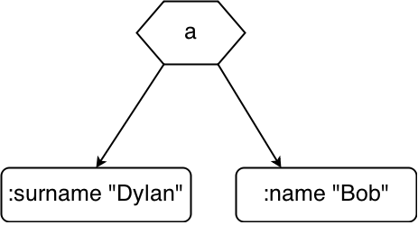
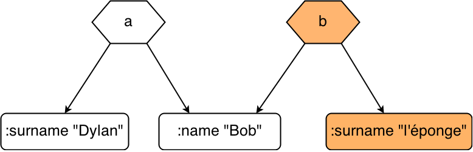

<!--- .slide data-background="images/clojure-logo.png" -->

<h1> Clojure <span class="fragment">(script)</span></h1>


-----
# Kezako?

-----
## un Lisp

<p class="big-parens">
  <span class="fragment">(</span>
  
  <span class="fragment">)</span>
</p>

compilation pour la JVM, et JS (Clojurescript !)

-----
## f(x) => (f x)

Pour appeler une fonction, on la met en première position entre parenthèses

```
(+ 1 2)
;; => 3

(+ 1 2 3)
;; => 6

(inc 1)
;; => 2

(= 2 (inc 1))
;; => true

(def ma-hash-map {:a 1})
(= {:a 1} ma-hash-map)
;; => true
```

-----
## Langage fonctionnel

```
(reduce + [1 2 3 4])
;; => 10

(filter odd? [1 2 3 4])
;; => [2 4]

(def inc3
  (comp inc inc inc))
(inc3 1)
;; => 4

(def join-and-up
  (comp upper-case
        (partial join ", ")))

(join-and-up ["a" "b" "c"])
;; => "A, B, C"

```

-----
## Plein de structures de données!!!

Les classiques {} et []

Les sets : #{1 2 3} => contrainte d'unicité

```
(conj 2 #{1 2 3})
;; => #{1 2 3}

(intersection #{1 2} #{2 3})
;; => #{2}
```

un peu plus exotiques: sorted-set (comme dans Redis!), sorted-map...

-----
## Par défaut, tous les types de données sont...
<h1 class="fragment">Immutables !!!</h1>

-----


-----
## En pratique

On ne pas transformer une variable sur place :

```
(def a {:name "Bob" :surname "Dylan"})
(def b (assoc a :surname "l'éponge"))

;; a => {:name "Bob" :surname "Dylan"}
;; b => {:name "Bob" :surname "l'éponge}

(= a b)
;; => false

```

-----
## Immutabilité: Pour quoi faire?

```js
var a = { name: "Bob", surname: "Dylan" };
var b = _.clone(a);

a === b; // => false

b.surname = "l'éponge";

// différence entre a et b
???????
```

-----
## En mémoire


```clojure

(def a {:surname "Dylan" :name "Bob"})

```



-----
## Structural Sharing

```clojure

(def a {:surname "Dylan" :name "Bob"})
(def b (assoc a :surname "l'éponge"))
```



-----
## Exemple : un article

-----
## Rien de nouveau sous le soleil...


C'est ce que git utilise pour stocker ses objets

=> calcul du delta entre 2 arbres très rapide!


En javascript : ImmutableJs  (par Facebook)

=> entre autre pour accélérer les rendus de React


-----
## Bonne inter-opérabilité

Accès aux libs Java et JS (pas aussi simple qu'un require, mais ça se fait).

Possibilité de faire des variables mutables si besoin (transient).

-----
## En savoir plus

<p> Rich Hickey (Créateur) </p>


<p> David Nolen (Développeur de Clojurescript)</p>

